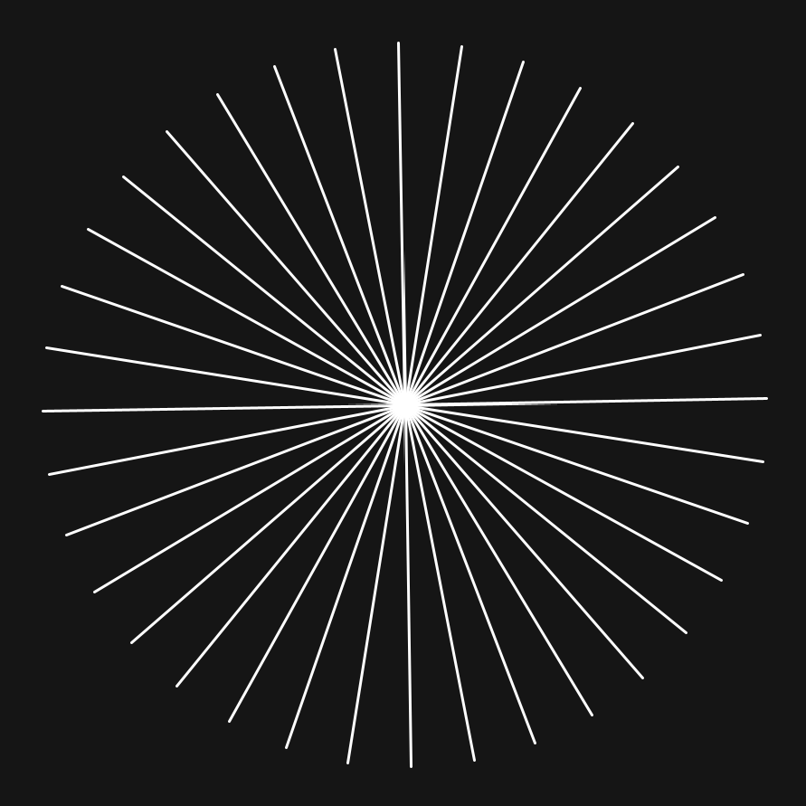

## 01 Animated circle of lines using sine
Tutorial takes inspiration from [thedotisblack Youtube tutorial](https://www.youtube.com/watch?v=ehT7d9JPulQ).
Credit the original artist if you use the code!

#### How to follow the tutorial
Open the Processing project and follow the instructions in the comments of the code. Uncomment/comment the lines of code and run the software in between to see how the project changes.

#### Topics
- drawing objects middle of the screen
- making objects rotate
- pushMatrix and popMatrix
- drawing lines and ellipses
- animating lines and ellipses

#### Some screenshots

<em>First progress picture after uncommenting the first line of code in the first part.</em>
  

<em>Second progress picture after uncommenting the fourth line of code in the first part.</em>
  

<em>Third progress picture after uncommenting the fifth line of code in the first part.</em>
  

<em>Finished project.</em>
