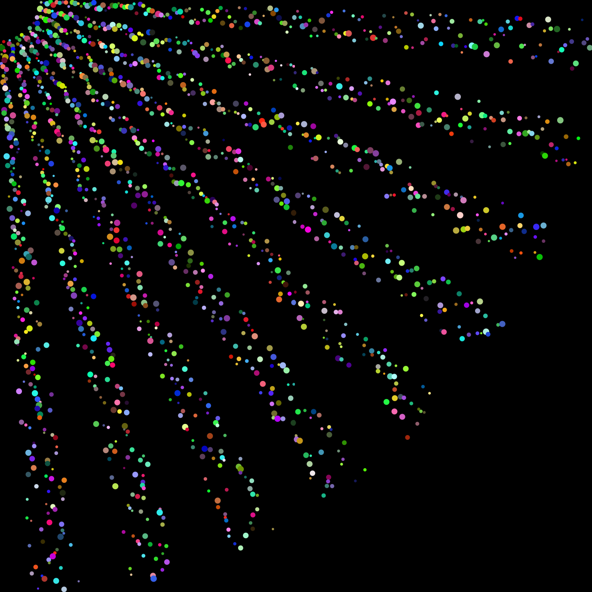

## 02 Printing dots
Tutorial takes inspiration from [FunProgramming.org](https://funprogramming.org/27-Animating-while-rotating.html).
Credit the original artist if you use the code!

#### How to follow the tutorial
Open the Processing project and follow the instructions in the comments of the code. Uncomment/comment the lines of code and run the software in between to see how the project changes.

#### Some screenshots

<em>First progress picture after uncommenting the first line of code in the first part.</em>
  

<em>Second progress picture after uncommenting the second line of code in the first part.</em>
  

<em>Third progress picture after uncommenting the first line of code in the second part.</em>
  

<em>Fourth progress picture after uncommenting the second line of code in the second part.</em>
  

<em>Extra part: drawing to another layer.</em>
