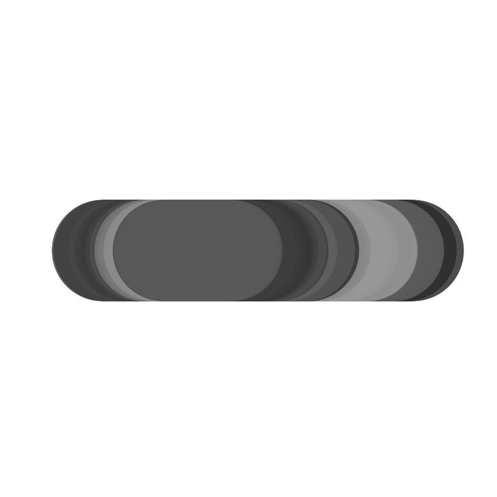
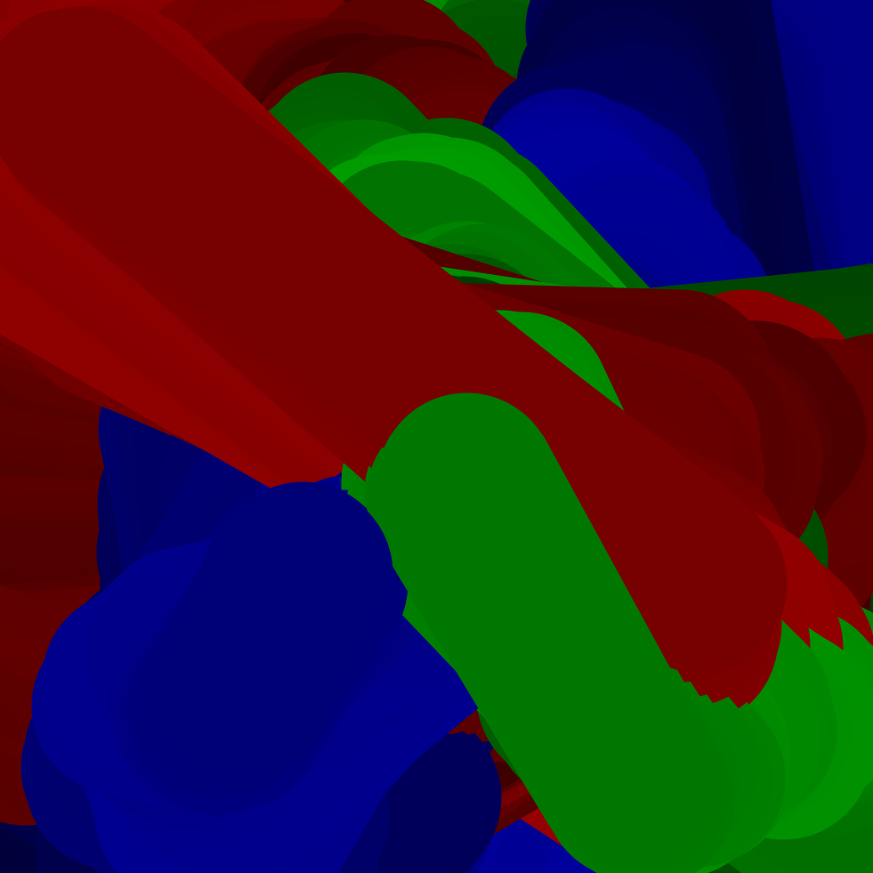
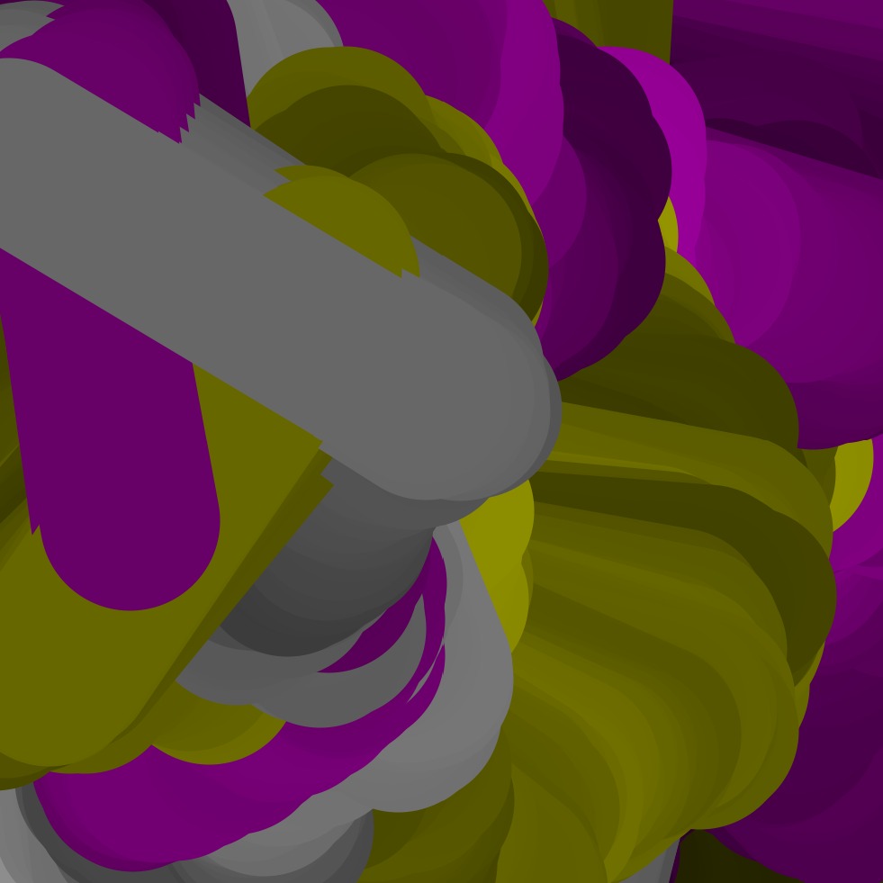

## 03 - Random Brush Strokes using Object-Oriented Programming
Tutorial takes inspiration from [thedotisblack Youtube](https://www.youtube.com/watch?v=9ZL9qSag7CY).
Credit the original artist if you use the code!

#### How to follow the tutorial
Open the Processing project and follow the instructions in the comments of the code. Uncomment/comment the lines of code and run the software in between to see how the project changes.

#### Topics
- how to use Object-Oriented Programming with Processing
- how RGB colors work

#### Some screenshots

<em>First progress picture after uncommenting the third line of code in the first part.</em>
  

<em>Second progress picture after uncommenting the second line of code in the second part.</em>
  

<em>Third progress picture after uncommenting the fourth part.</em>
  

<em>Extra part: test different colors.</em>
