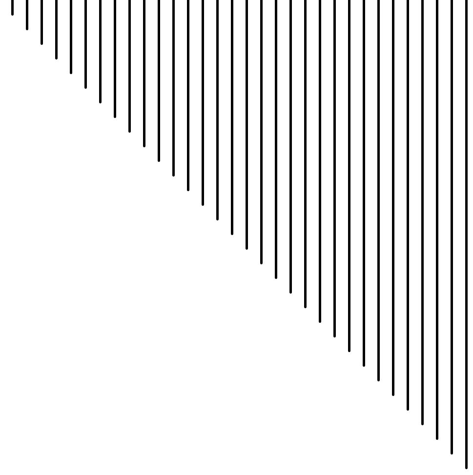
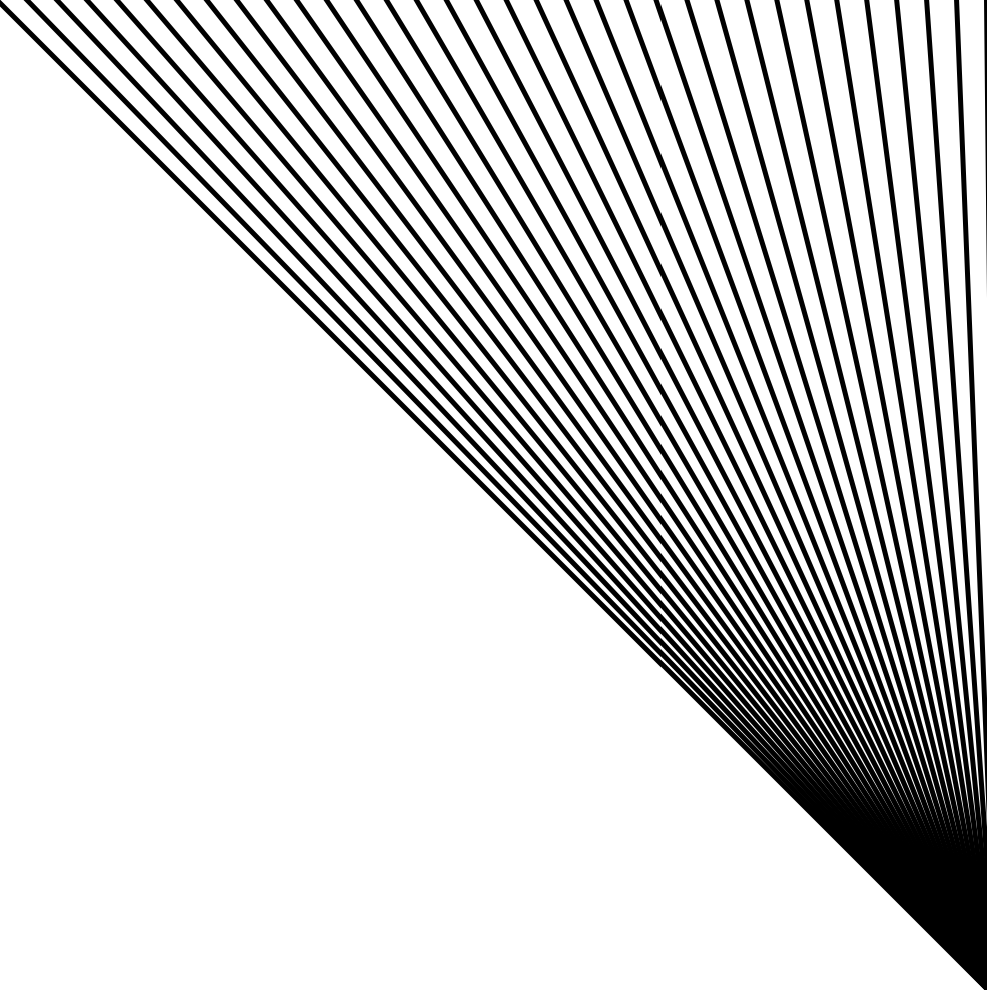
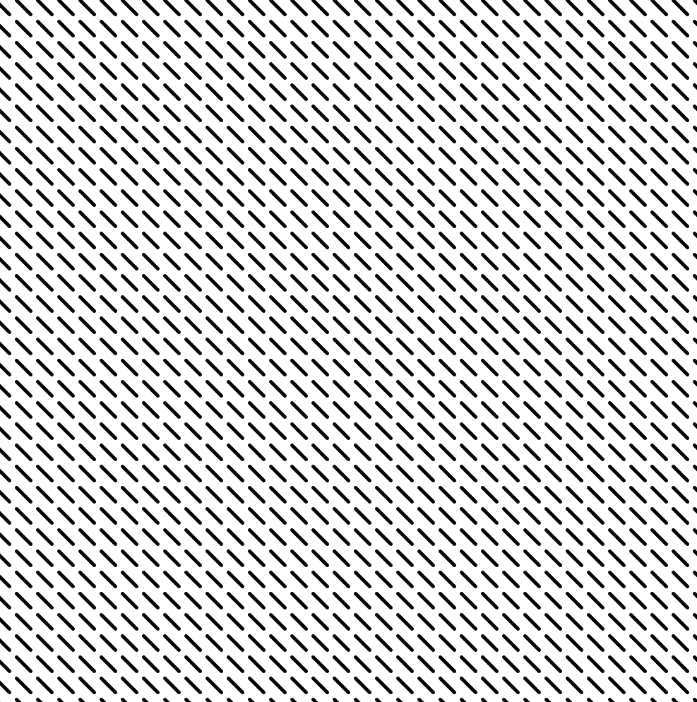
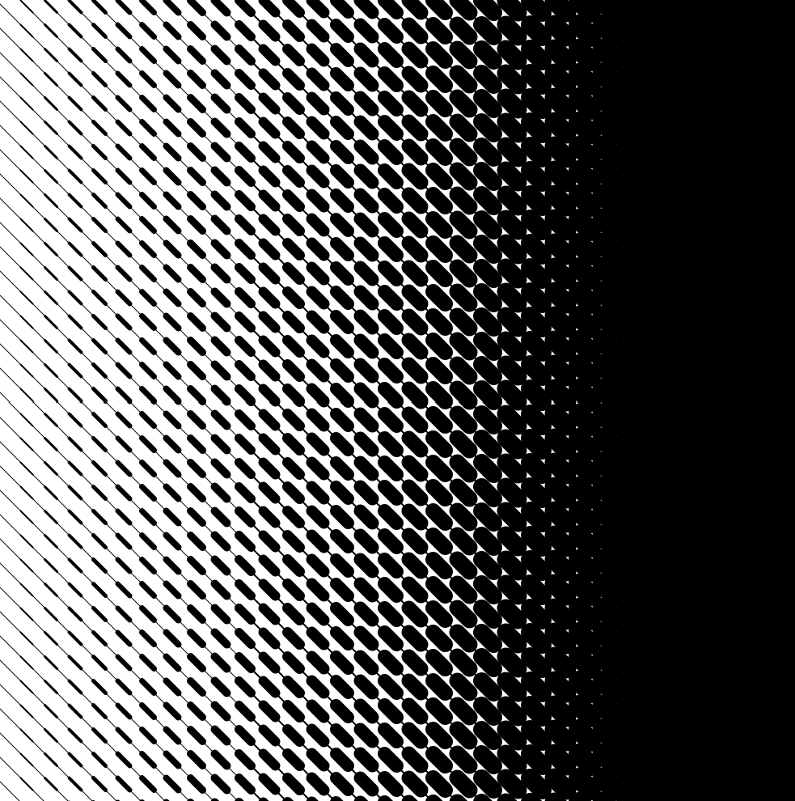
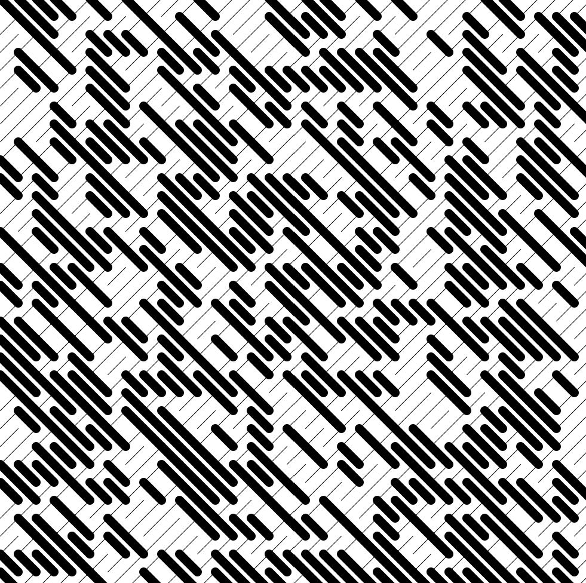

## 04 - Generating Lines
Tutorial takes inspiration from [Ibby EL-Serafy's blog](https://theibbster.medium.com/a-gentle-introduction-to-coding-by-making-generative-art-c7f0a7b744a6).
Credit the original artist if you use the code!

#### How to follow the tutorial
Open the Processing project and follow the instructions in the comments of the code. Uncomment/comment the lines of code and run the software in between to see how the project changes.

#### Topics
- disabling looping on draw() function
- using for loops
- using nested for loops

#### Some screenshots

<em>First progress picture after uncommenting the third line of code in the first part.</em>
  

<em>Second progress picture after uncommenting the second line of code in the second part.</em>
  

<em>Third progress picture after uncommenting the fourth part.</em>
  

<em>Extra part: test different colors.</em>

<em>Extra part: test different colors.</em>
